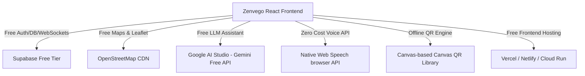

# Zenvego - Hyperlocal Farmers Market Project Documentation

Welcome to the official developer and architecture guide for **Zenvego**. This document contains everything your development team needs to fully understand the project's structure, goals, packages, "Zero Budget" philosophy, and how to build out the future backend.

---

## 1. Project Vision & Goals

**Zenvego** is a premium, zero-waste, farm-to-table marketplace that directly connects local organic farmers with customers and local delivery partners, completely bypassing middlemen.

### Core Features
*   **Three Integrated Portals**: Single application router catering to **Customers (Buyers)**, **Farmers (Sellers)**, and **Delivery Partners (Couriers)**.
*   **Localization Engine**: Instant country/region switching supporting **US Customary Units** (lbs, miles, USD) and **Indian Metric Units** (kg, km, INR), along with multi-currency conversion.
*   **Zero-Overhead Real-time GPS Tracking**: Leaflet-based navigation interface for delivery partners to execute pickups and drop-offs.
*   **Ecosystem Verification Handoffs**: Security verified through physical QR code scanning or 4-digit verification PINs generated locally.
*   **ZenBot AI Assistant**: Context-aware customer care agent powered by the Google Gemini API, with a pre-coded rule-based fallback when offline.
*   **Voice Integration**: Complete accessibility via hands-free voice commands.

---

## 2. The "Zero Budget" Development Philosophy

To launch Zenvego without incurring costs, we selected a toolchain that remains entirely free under ordinary developer thresholds. **Do not deviate from these choices to ensure we do not incur bills.**



### What We Used (Allowed Tools)
1.  **Supabase (Free Tier)**: Provides PostgreSQL database, Magic Link Authentication, and Realtime WebSocket engine for zero cost.
2.  **Leaflet.js + OpenStreetMap**: Fully open-source mapping. Requires no credit cards, unlike Google Maps or Mapbox.
3.  **Google AI Studio (Gemini 1.5 Flash)**: Free-tier access to Gemini models using API Keys.
4.  **Web Speech API**: Uses the user's native web browser engine for speech recognition and speech synthesis (100% free, zero cloud API queries).
5.  **Offline QR Codes**: Generated directly in the browser canvas using `qrcode`. Doesn't call external pay-per-request QR generation APIs.

### 🚫 What NOT to Download / Buy (Stay Away From)
> [!CAUTION]
> Installing or integrating the following will break our "Zero Budget" model. DO NOT download or license:
> 1. **Google Maps SDK or Mapbox GL JS**: They charge per map load/route calculation. Stick to Leaflet + OpenStreetMap.
> 2. **Twilio SMS Gateway**: Charges per SMS OTP. Use Supabase email-based Magic Links (free up to 50k emails/month) instead.
> 3. **Firebase / AWS RDS / MongoDB Atlas Paid Tiers**: Avoid hosting databases on services with complex pay-as-you-go pricing. Stick to Supabase's generous free tier.
> 4. **Paid Speech APIs (Google Cloud Text-to-Speech / Azure Cognitive)**: These charge per character. Stick to the native Web Speech API (`window.SpeechRecognition`).
> 5. **Clerk or Auth0**: They introduce user limits or high pricing for premium features. Supabase Auth is free and unlimited.

---

## 3. Installed Packages (`package.json`)

Here is what we have installed in this project and why:

### Production Dependencies (`dependencies`)
*   `react` & `react-dom` (v19): Modern UI foundation.
*   `vite`: Next-generation bundler for high-speed local development.
*   `@tailwindcss/vite` & `tailwindcss`: Utility-first CSS styling engine (v4).
*   `@supabase/supabase-js`: Official JavaScript/TypeScript client library for Supabase Auth, DB, and Realtime WebSockets.
*   `@google/genai` & `@google/generative-ai`: SDKs to communicate with Gemini 1.5 Flash models.
*   `leaflet` & `react-leaflet`: Client-side maps renderer and container wrapper.
*   `lucide-react`: Lightweight, clean vector icon pack.
*   `motion` (formerly Framer Motion): Modern GPU-accelerated micro-animations.
*   `qrcode` & `react-qr-code`: Library to generate QR codes locally on HTML canvases.
*   `html5-qrcode`: High-performance camera stream QR Code scanner.
*   `dotenv`: Loads environment variables locally from `.env`.
*   `express`: Used to host preview servers (optional/deployment).

### Development Dependencies (`devDependencies`)
*   `typescript`: Adds static typing for reliable refactoring.
*   `tsx`: Execute TypeScript files directly in Node.js.
*   `autoprefixer`: Parses CSS and adds vendor prefixes automatically.
*   `@types/node`, `@types/leaflet`, `@types/qrcode`, `@types/express`: TypeScript definitions for standard libraries.

---

## 4. File-by-File Breakdown ("Every Line Information")

Here is the exact responsibility of every main source file inside `/src`:

### Core Setup Files
*   **[index.html](file:///d:/zenvego%20%281%29/index.html)**: Main HTML entry. Loads Google Fonts (`Plus Jakarta Sans`), Google Material Icons, and maps stylesheet. Serves the `#root` div.
*   **[src/main.tsx](file:///d:/zenvego%20%281%29/src/main.tsx)**: Mounts the main React component (`App.tsx`) to `#root`.
*   **[src/index.css](file:///d:/zenvego%20%281%29/src/index.css)**: Holds global layout configurations, custom glassmorphism styles, color scheme tokens, and custom scrollbar overrides.
*   **[src/types.ts](file:///d:/zenvego%20%281%29/src/types.ts)**: Declares core TypeScript interfaces. Includes `ViewState` (router paths), `LoggedInUser`, `CartItem`, and `Product`.

### Core App Shell
*   **[src/App.tsx](file:///d:/zenvego%20%281%29/src/App.tsx)**:
    *   **State Control**: Coordinates active view routers (`currentView`), shopping cart (`cart`), notification banners (`toasts`), and localized preferences.
    *   **ZenBot Engine**: Contains the REST API connection to the Gemini API (`callGeminiAI`). Evaluates the user's active role context to adjust instructions, and runs `getSmartFallback` if offline.
    *   **Mock Console Panel**: A sticky side utility panel enabling developer previewing of all views (Landing page, Marketplace, Checkout, Dashboards, and Route navigation) and regional customization instantly.
    *   **Supabase Hook**: Registers the `supabase.auth.onAuthStateChange` listener to persist credentials or automatically redirect users upon sign-in.

### Component Layer (`src/components/`)
*   **[FarmersMarketHome.tsx](file:///d:/zenvego%20%281%29/src/components/FarmersMarketHome.tsx)**: The landing page. Highlights organic produce, features farmer cards, displays region metrics, and allows quick role selection to bypass credentials.
*   **[BuyerMarketplace.tsx](file:///d:/zenvego%20%281%29/src/components/BuyerMarketplace.tsx)**: Interactive shopping dashboard. Supports item search, categorization, stock level monitoring, and add-to-cart operations.
*   **[CheckoutView.tsx](file:///d:/zenvego%20%281%29/src/components/CheckoutView.tsx)**: Coordinates basket summary, pricing breakdown, Razorpay simulated checkout, and handles order publishing.
*   **[FarmerDashboard.tsx](file:///d:/zenvego%20%281%29/src/components/FarmerDashboard.tsx)**: Displays metrics (earnings, orders, waste diversion). Contains the order status queue and order handoff scanner for drivers.
*   **[FarmerInventory.tsx](file:///d:/zenvego%20%281%29/src/components/FarmerInventory.tsx)**: Form to add/edit crops, configure stock availability, set locations, and modify descriptions.
*   **[DeliveryDashboard.tsx](file:///d:/zenvego%20%281%29/src/components/DeliveryDashboard.tsx)**: Renders job offers for couriers, showcases earnings, and displays delivery request queues.
*   **[DeliveryActiveRoute.tsx](file:///d:/zenvego%20%281%29/src/components/DeliveryActiveRoute.tsx)**: Interactive Leaflet-powered routing page. Displays navigation lines, directions, coordinates between pickup and destination, and generates/scans secure verification keys.
*   **[LoginView.tsx](file:///d:/zenvego%20%281%29/src/components/LoginView.tsx)**: Form interface offering Supabase Magic Links, Mock sandbox accounts, Google Single Sign-on, and Passkey interfaces.
*   **[RegistrationOnboarding.tsx](file:///d:/zenvego%20%281%29/src/components/RegistrationOnboarding.tsx)**: Onboarding questionnaire. Gathers farmer certifications, delivery vehicle configuration, and contact metrics to create database profiles.
*   **[CurrencySelector.tsx](file:///d:/zenvego%20%281%29/src/components/CurrencySelector.tsx)**: A custom UI control bar to instantly convert prices across USD, INR, EUR, etc.
*   **[QrCodeRenderer.tsx](file:///d:/zenvego%20%281%29/src/components/QrCodeRenderer.tsx)**: Draws secure transaction IDs onto local HTML Canvas elements for instant scanning.
*   **[MyAccountView.tsx](file:///d:/zenvego%20%281%29/src/components/MyAccountView.tsx)**, **[SellerAccountView.tsx](file:///d:/zenvego%20%281%29/src/components/SellerAccountView.tsx)**, **[DeliveryAccountView.tsx](file:///d:/zenvego%20%281%29/src/components/DeliveryAccountView.tsx)**: Role-specific profile management panels.

### Utilities (`src/utils/` and `src/lib/`)
*   **[src/lib/supabase.ts](file:///d:/zenvego%20%281%29/src/lib/supabase.ts)**: Configures the Supabase client using `.env` variables or fallback settings.
*   **[src/utils/orderBus.ts](file:///d:/zenvego%20%281%29/src/utils/orderBus.ts)**:
    *   **Publishing Engine**: Connects to the database and pushes changes. If network connection fails or tables are absent, falls back to `localStorage` cache.
    *   **Realtime Websocket**: Listens to changes in database table `orders` using `postgres_changes`.
*   **[src/utils/currency.ts](file:///d:/zenvego%20%281%29/src/utils/currency.ts)**: Math helper. Defines base rates (e.g. `$1 USD = ₹83.50 INR`) and formats price symbols dynamically.
*   **[src/utils/measurement.ts](file:///d:/zenvego%20%281%29/src/utils/measurement.ts)**: Handles conversions between imperial metrics (miles/lbs) and international systems (km/kg) based on location choice.
*   **[src/utils/speech.ts](file:///d:/zenvego%20%281%29/src/utils/speech.ts)**: Orchestrates speech listeners, handles browser SpeechRecognition fallbacks, and executes clean voice inputs.
*   **[src/utils/imageFallback.ts](file:///d:/zenvego%20%281%29/src/utils/imageFallback.ts)**: Prevents broken links by supplying clean placeholder vectors for produce.

---

## 5. Future Backend Database Setup (SQL Schema)

When your backend team is ready to fully transition away from offline mocks to the Supabase database, execute the following SQL script inside the **Supabase SQL Editor**:

```sql
-- 1. Enable UUID Extension
create extension if not exists "uuid-ossp";

-- 2. Profiles Table (Stores Customer, Farmer, & Driver data)
create table public.profiles (
  id uuid references auth.users on delete cascade primary key,
  name text not null,
  email_or_phone text not null,
  role text check (role in ('customer', 'seller', 'delivery')) not null default 'customer',
  avatar_url text,
  metadata jsonb default '{}'::jsonb,
  created_at timestamp with time zone default timezone('utc'::text, now()) not null
);

-- Enable Row Level Security (RLS)
alter table public.profiles enable row level security;

create policy "Public profiles are viewable by everyone"
  on public.profiles for select using (true);

create policy "Users can update their own profile"
  on public.profiles for update using (auth.uid() = id);

-- 3. Products Table (Farmers Catalog)
create table public.products (
  id uuid default uuid_generate_v4() primary key,
  farmer_id uuid references public.profiles(id) on delete cascade,
  name text not null,
  price numeric(10, 2) not null, -- stored in base USD
  qty numeric(10, 2) not null,
  unit text not null,
  category text not null,
  image text,
  farm text not null,
  farmer_name text not null,
  description text,
  organic boolean default true,
  boosted boolean default false,
  origin text,
  created_at timestamp with time zone default timezone('utc'::text, now()) not null
);

alter table public.products enable row level security;

create policy "Products are readable by everyone"
  on public.products for select using (true);

create policy "Farmers can insert their own products"
  on public.products for insert with check (auth.uid() = farmer_id);

create policy "Farmers can update their own products"
  on public.products for update using (auth.uid() = farmer_id);

create policy "Farmers can delete their own products"
  on public.products for delete using (auth.uid() = farmer_id);

-- 4. Orders Table (Live Handoff & Dispatch)
create table public.orders (
  id uuid default uuid_generate_v4() primary key,
  customer_id uuid references public.profiles(id),
  items jsonb not null, -- contains array of { id, name, qty }
  total_amount numeric(10, 2) not null,
  status text check (status in ('pending', 'dispatched', 'delivered')) default 'pending',
  delivery_pin text,
  delivery_partner_id uuid references public.profiles(id),
  created_at timestamp with time zone default timezone('utc'::text, now()) not null
);

alter table public.orders enable row level security;

create policy "Orders are viewable by related parties"
  on public.orders for select using (
    auth.uid() = customer_id
    or auth.uid() = delivery_partner_id
    or exists (
      select 1 from public.products p
      where (items->>'id') = p.id::text and p.farmer_id = auth.uid()
    )
  );

create policy "Customers can place orders"
  on public.orders for insert with check (auth.uid() = customer_id);

create policy "Related parties can update order status"
  on public.orders for update using (true);
```
---

## 6. How to Deploy the Application (Free Hosting)

Since our budget is zero, deploy using these free options:

1.  **Frontend (React/Vite)**:
    *   Deploy to **Vercel** or **Netlify** or **GitHub Pages**. All three are completely free for personal/developer projects.
    *   Ensure you bind the environment variables `VITE_SUPABASE_URL` and `VITE_SUPABASE_ANON_KEY` inside the hosting provider's setting dashboard.
2.  **Database / Serverless API**:
    *   We do not need a custom Node.js server! By using Supabase directly from React (`@supabase/supabase-js`), the database itself acts as our backend. We save on server hosting entirely.
    *   Auth, DB, and Realtime queries run directly from the browser safely using Postgres Row Level Security (RLS) policies.
